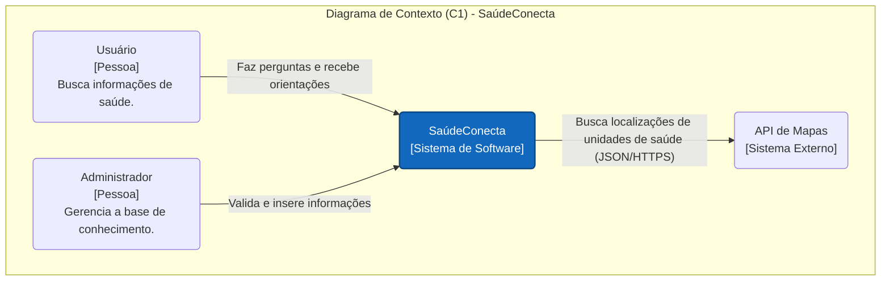
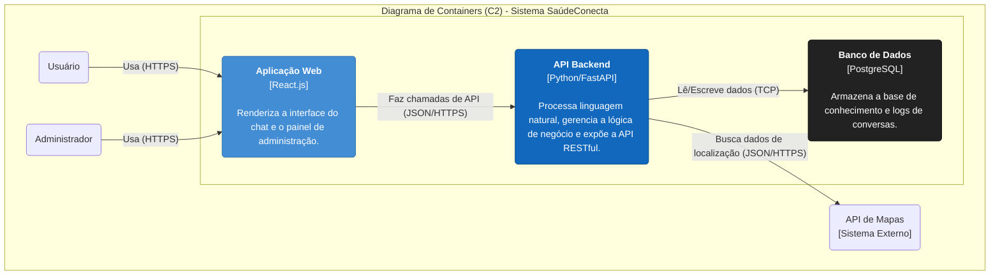

# Documentação da Arquitetura - SaúdeConecta

Este documento detalha a arquitetura de software para o projeto **SaúdeConecta**, um chatbot de IA para informações de saúde. A estrutura a seguir atende aos requisitos de fornecer um modelo arquitetural, explicar as tecnologias escolhidas e justificar o modelo.

---

## (ii) O Projeto Arquitetural (C4 Model)

Para visualizar a arquitetura, utilizamos o **C4 Model**, focando nos níveis de Contexto (C1) e Containers (C2) para fornecer uma visão clara do sistema e seus componentes principais.

### Nível 1: Diagrama de Contexto do Sistema (C1)

O Diagrama de Contexto mostra o sistema como uma "caixa preta", destacando suas interações com usuários (atores) e outros sistemas. Ele define os limites e o escopo do nosso software.

* **Atores:**
    * **Usuário:** Qualquer pessoa que interage com o chatbot para obter informações.
    * **Administrador de Conteúdo:** Um profissional responsável por gerenciar e validar a base de conhecimento do chatbot.
* **Sistemas Externos:**
    * **API de Mapas:** Um serviço de terceiros (como Google Maps) para localizar unidades de saúde.

### Nível 2: Diagrama de Containers (C2)

O Diagrama de Containers amplia a "caixa preta" do C1, revelando os principais componentes de alto nível que compõem o sistema. Cada container é uma unidade implantável e executável de forma independente.

* **Containers:**
    * **Aplicação Web (Frontend):** Uma aplicação de página única (SPA) que renderiza a interface do chat no navegador do usuário.
    * **API Backend (Motor de IA):** O cérebro da aplicação. Processa as mensagens, aplica a lógica de IA/PLN e se comunica com o banco de dados.
    * **Banco de Dados:** Armazena toda a base de conhecimento, incluindo perguntas, respostas, sinônimos e metadados.

## (i) Escolhas de Tecnologias

A seleção de tecnologias foi baseada nos requisitos funcionais e não funcionais do projeto, priorizando performance, ecossistema e adequação ao problema.

| Container                | Tecnologia Escolhida | Justificativa da Escolha                                                                                                                                                           |
| :----------------------- | :------------------- | :--------------------------------------------------------------------------------------------------------------------------------------------------------------------------------- |
| **Aplicação Web (Frontend)** | **React.js** | É uma biblioteca líder de mercado para criar interfaces de usuário dinâmicas. Sua vasta comunidade, o ecossistema de bibliotecas (para componentes de chat, etc.) e o modelo baseado em componentes agilizam o desenvolvimento e facilitam a manutenção. |
| **API Backend (Motor de IA)** | **Python com FastAPI** | **Python** é a linguagem de fato para aplicações de Inteligência Artificial e Processamento de Liguagem Natural (PLN), oferecendo bibliotecas poderosas como `spaCy` e `scikit-learn`. **FastAPI** foi escolhido por ser um framework web moderno, extremamente rápido e com documentação automática, ideal para construir APIs robustas. |
| **Banco de Dados** | **PostgreSQL** | É um banco de dados relacional de código aberto, conhecido por sua robustez, confiabilidade e conformidade com o padrão SQL. Seu suporte avançado a tipos de dados, como `JSONB`, é perfeito para armazenar a base de conhecimento de forma estruturada, mas com flexibilidade para metadados. |

---

## (iii) Justificativa do Modelo Escolhido

A arquitetura baseada em **containers desacoplados** (Frontend, Backend, Banco de Dados) foi escolhida por ser uma abordagem moderna e resiliente, que traz os seguintes benefícios estratégicos para o projeto:

* **Desacoplamento e Manutenibilidade:** Cada container é uma unidade independente. Isso significa que a equipe de frontend pode alterar a interface do chat sem afetar o motor de IA no backend. Essa separação de responsabilidades simplifica a manutenção e permite que as equipes trabalhem em paralelo.

* **Escalabilidade Granular:** Se o chatbot se tornar muito popular, podemos aumentar o número de instâncias da API Backend para lidar com a carga, sem precisar alterar o frontend ou o banco de dados. Essa capacidade de escalar apenas os componentes necessários otimiza custos e recursos.

* **Flexibilidade e Prova de Futuro:** A comunicação entre o frontend e o backend ocorre via uma API padronizada (RESTful). Isso permite que, no futuro, novos "clientes" consumam a mesma API, como um aplicativo móvel nativo, um bot para Telegram ou um assistente de voz, sem a necessidade de reescrever a lógica de negócio principal.

* **Otimização Tecnológica:** A arquitetura permite usar a "ferramenta certa para o trabalho certo". Usamos o ecossistema JavaScript (React) para o que ele faz de melhor — criar interfaces de usuário interativas — e o ecossistema Python para o que ele faz de melhor — processamento de dados e IA.
